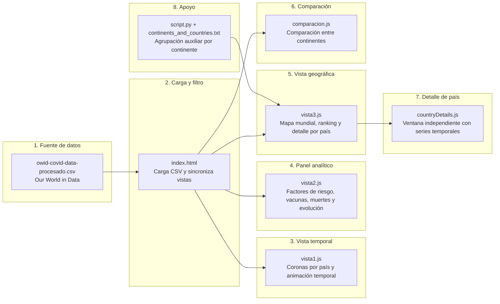

# Proyecto Final TCD

# Dashboard Interactivo de Análisis COVID-19

> Aplicación web estática para explorar la evolución del COVID-19 por continente y país mediante visualizaciones interactivas construidas con D3.js y Plotly.


---

Este proyecto fue desarrollado como trabajo final para una asignatura de Ciencia de Datos. Su objetivo es analizar datos globales de COVID-19 con una interfaz visual que permita explorar tendencias temporales, comparar continentes y revisar detalles por país.

## Resumen

La aplicación consume un dataset procesado de Our World in Data y lo presenta en tres paneles principales:

- una vista temporal con visualización por país,
- un panel analítico con gráficos comparativos,
- un mapa mundial interactivo con ranking y detalles.

Además, incorpora un módulo de comparación entre continentes y una ventana de detalle para países específicos.

## Objetivo

El objetivo del proyecto es convertir un conjunto de datos epidemiológicos en una experiencia de análisis visual clara e interactiva. La idea principal es facilitar la comprensión de la evolución del COVID-19 a través de:

- comparación entre continentes,
- lectura de indicadores sanitarios y demográficos,
- seguimiento temporal de casos, muertes y vacunación,
- exploración geográfica por país.

## Arquitectura general

1. El navegador carga el archivo [owid-covid-data-procesado.csv](owid-covid-data-procesado.csv).
2. El script principal filtra los datos por continente.
3. Cada vista recibe el subconjunto correspondiente y renderiza su propia visualización.
4. El usuario puede cambiar de continente desde el mapa, desde el selector oculto o mediante la lógica interna de sincronización.
5. La comparación entre continentes se ejecuta desde un modal dedicado.
6. El detalle por país se abre como una ventana independiente con gráficas y resumen estadístico.



## Vistas principales

### Vista 1: Evolución temporal por continente

La primera vista muestra una representación visual tipo corona por país dentro del continente seleccionado. Esta vista está pensada para observar el comportamiento temporal del COVID-19 con animación, zoom y estado por país.

Características destacadas:

- animación temporal controlada desde el panel principal,
- interacción por hover sobre cada país,
- visualización de casos acumulados y series por período,
- sincronización con el continente activo.

### Vista 2: Panel de análisis COVID-19

La segunda vista organiza cuatro gráficos complementarios:

- factores de riesgo como diabetes, enfermedades cardiovasculares, población mayor y pobreza extrema,
- contagios vs vacunación,
- casos por país o evolución de un país específico,
- contagios vs muertes.

Esta vista combina análisis descriptivo y evolución temporal para comparar variables sanitarias y epidemiológicas.

### Vista 3: Mapa mundial interactivo

La tercera vista presenta un mapa mundial con selección de continentes, ranking lateral de países y navegación por zoom y arrastre.

Incluye:

- selección de continente desde el mapa,
- ranking top de países según el período activo,
- tooltips con información contextual,
- botón de acceso al detalle completo de cada país,
- fallback de mapa simplificado si falla la carga del mapa externo.

## Comparación entre continentes

El módulo [comparacion.js](comparacion.js) permite abrir un modal para seleccionar dos continentes y compararlos en una ventana separada. Este flujo sirve para contrastar métricas agregadas y revisar diferencias de comportamiento entre regiones.

## Detalle por país

El módulo [countryDetails.js](countryDetails.js) abre una vista detallada con:

- gráficas temporales del país,
- indicadores acumulados,
- resumen estadístico,
- variables de contexto demográfico y sanitario.

## Fuente de datos

El proyecto utiliza el archivo [owid-covid-data-procesado.csv](owid-covid-data-procesado.csv), que contiene variables como:

- casos totales y nuevos,
- muertes totales y nuevas,
- vacunaciones,
- población,
- edad media y distribución etaria,
- pobreza extrema,
- muertes cardiovasculares,
- prevalencia de diabetes,
- índice de restricciones,
- casos y muertes por millón.

## Estructura del repositorio

- [index.html](index.html): entrada principal de la aplicación y orquestación global.
- [styles.css](styles.css): estilos del layout, paneles, modales y controles.
- [vista1.js](vista1.js): vista temporal por países dentro del continente.
- [vista2.js](vista2.js): panel de análisis con cuatro gráficos.
- [vista3.js](vista3.js): mapa mundial, ranking y navegación geográfica.
- [comparacion.js](comparacion.js): comparación entre continentes.
- [countryDetails.js](countryDetails.js): ventana de detalle por país.
- [EventManager.js](EventManager.js): gestor simple de eventos globales.
- [script.py](script.py): agrupación auxiliar de países por continente.
- [continents_and_countries.txt](continents_and_countries.txt): salida generada con el listado de continentes y países.

## Cómo funciona

1. Se abre [index.html](index.html) en el navegador.
2. El archivo carga el CSV con D3.
3. Se identifican los continentes disponibles.
4. Las tres vistas se inicializan y esperan el continente seleccionado.
5. El usuario interactúa con el mapa, el botón de comparación o la animación temporal.
6. La interfaz actualiza todos los paneles de forma sincronizada.

## Ejecución local

Como es una aplicación estática, basta con servir la carpeta con un servidor local para evitar problemas de carga del CSV.

### Opción 1: Python

```bash
python -m http.server 8000
```

### Opción 2: Live Server en VS Code

1. Abrir la carpeta del proyecto en VS Code.
2. Instalar la extensión Live Server si no está disponible.
3. Abrir [index.html](index.html) con Live Server.

## Notas técnicas

- La aplicación no tiene backend.
- Las visualizaciones se construyen directamente en el navegador.
- El mapa mundial intenta cargar geometría externa y usa un fallback si la fuente CDN falla.
- El archivo [script.py](script.py) solo genera un apoyo textual para el mapa, no forma parte del flujo principal de renderizado.

## Imágenes

Esta sección está pensada para incluir capturas del proyecto en tu portafolio o presentación. Si agregas imágenes al repositorio, puedes referenciarlas aquí para mostrar el aspecto real de cada vista.

### Vista general


### Vista temporal


### Panel analítico


### Mapa interactivo


### Comparación entre continentes


## Alcance académico y profesional

Este trabajo demuestra el uso de visualización interactiva de datos, análisis exploratorio y sincronización entre múltiples vistas para un problema real de salud pública. El proyecto está orientado a mostrar capacidad de diseño analítico, organización de código frontend y comunicación visual de hallazgos, lo que lo hace adecuado para una presentación académica y también para un portafolio profesional.

## Licencia

Proyecto académico. Uso libre para fines educativos y de portafolio.